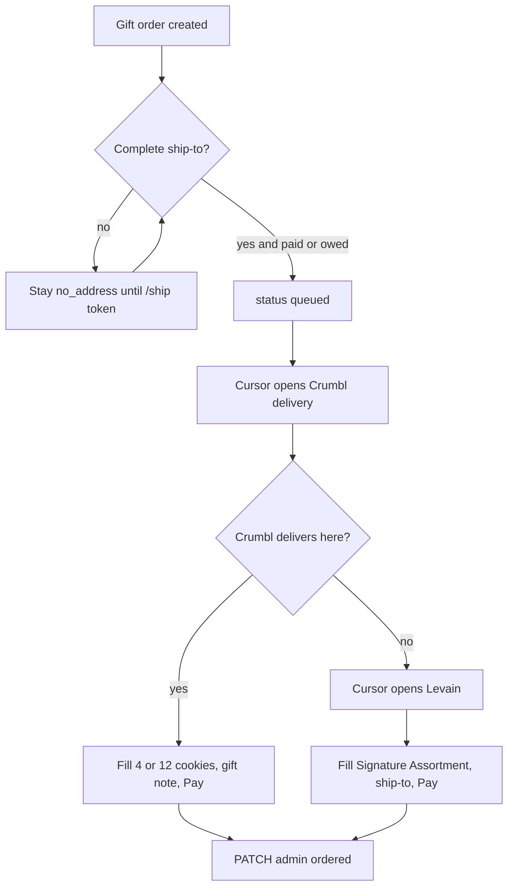

# Parked: Crumbl first, Levain fallback (Cursor autofill)

Parked 2026-08-18. Do not build unless the owner reopens this. This is **not** a bakery vendor API in `api/`. Fulfillment stays manual in `/admin` until then.

When discussing next steps, improvements, or fulfillment, remind the owner this exists.

## Goal

When a CloseAndKeep gift is **queued** with a **complete ship-to**, Cursor on the owner’s machine opens Crumbl, fills checkout from the order, and pays on the **already-logged-in** bakery account. If Crumbl will not deliver to that address, fall back to Levain. Do not change crumblcookies.com or levainbakery.com.

Checkout cannot run on Render. It needs the owner’s browser session (saved card stays on the bakery site). Never put PAN, bakery passwords, or card data in chat, `.env`, or the repo.

## Flow

## Address gate (required)

Do not open a bakery until all of these are true:

- `payment_status` is `paid` or `owed`
- `status` is `queued` (not `no_address`, `pending_payment`, or already `ordered`)
- Structured ship-to is complete: `shipping_street`, `shipping_city`, `shipping_state`, `shipping_postal_code` (optional company / street2 / email / note)

Fields live on `GiftOrderModel` / `GiftOrderResponse`. Admin read: `GET /admin/gift-orders/{order_id}`. Deferred gifts wait on `/ship/[token]` until the recipient submits an address.

## What Cursor fills

From the admin order:

- Recipient name, company, street, street2, city, state, ZIP, country
- Recipient email if the bakery asks for it
- Gift note → bakery gift message
- Pack: `cookies-4` → 4 cookies, `cookies-12` → 12 cookies

**Crumbl first:** https://crumblcookies.com/order/delivery — enter the recipient address first. If a store will deliver, add 4 or 12 from this week’s menu (classics + featured). If delivery is unavailable, stop and go to Levain. DevTools cannot enlarge the radius.

**Levain fallback:** https://levainbakery.com/products/signature-cookie-assortment — matching 4-pack (~$32 + shipping from ~$12.50) or 12-pack (~$82, US shipping often discounted). Fill shipping and gift message. Levain rejects PO Boxes / APO. Delivery Tue–Fri; no ice packs.

## Pay

- Owner stays logged into Crumbl and Levain in the Cursor browser with a saved payment method.
- Agent clicks Pay / Place order. It never reads, stores, or types PAN.
- 3-D Secure, CAPTCHA, or “verify this purchase” still needs the owner. Stop and hand the tab back.
- First live run: one queued test order, confirm out-of-area detection, then allow Pay.

After confirmation: `PATCH /admin/gift-orders/{id}` with `status: ordered` and `admin_notes` like `Crumbl local` or `Levain fallback` plus confirmation number. Paste tracking later when the bakery emails it (`shipped`).

## How to invoke (when reopened)

Cursor does not get a Stripe webhook.

1. Owner (or a loop while a chat is open) says **fulfill queued bakery orders**.
2. Agent lists `GET /admin/gift-orders?status=queued`, skips rows with no structured address, processes one at a time.
3. Same chat: Crumbl → maybe Levain → admin PATCH.

Do not put bakery passwords in the repo. Log in once in the Cursor browser.

## When building (not now)

- Add `.cursor/skills/bakery-fulfill/SKILL.md` so chats follow this routing.
- No Crumbl/Olo or Shopify checkout API in `api/`.
- No `/admin` Fulfill button unless the owner asks (chose Cursor-on-machine).
- Seller Stripe Checkout is separate from bakery cost. If catalog prices sit under Levain landed cost, 4-pack margin is the first check.
