# CloseAndKeep setup for a custom CRM

**For Zack** (account + API key) and **Claude** (the changes to your CRM).

CloseAndKeep does not have a one-click “Connect” button for home-grown CRMs. Salesforce and HubSpot use OAuth on the Integrations page. A custom CRM connects with an **API key** and two HTTP calls: create a prospect, then create a cookie order.

Public site: [https://www.closeandkeep.com](https://www.closeandkeep.com)  
API host: `https://api.closeandkeep.com`  
API docs: [https://www.closeandkeep.com/developers](https://www.closeandkeep.com/developers)

---

## Part 1 — Zack: create your CloseAndKeep account

Do this in a browser. Do **not** use “Continue as guest.” Guest sessions cannot create API keys or keep your history.

### Step 1. Open the website

Go to **[https://www.closeandkeep.com](https://www.closeandkeep.com)**.

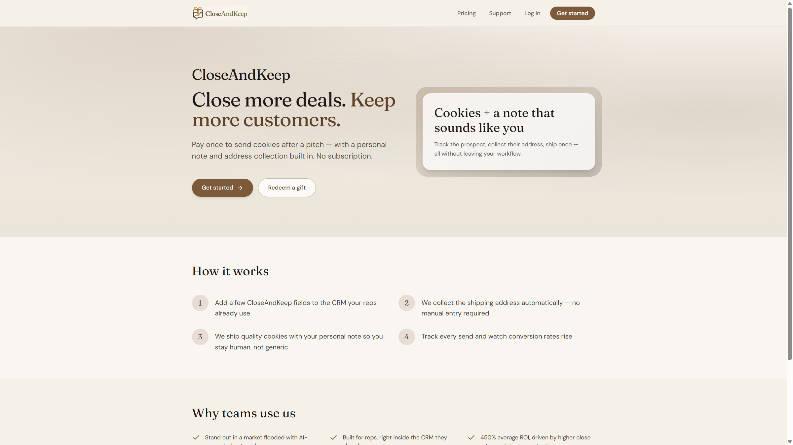

In the top right, click the brown **Get started** button. You can also click **Get started** under the headline.

### Step 2. Create an account

You land on **Create account** (`/signup`).

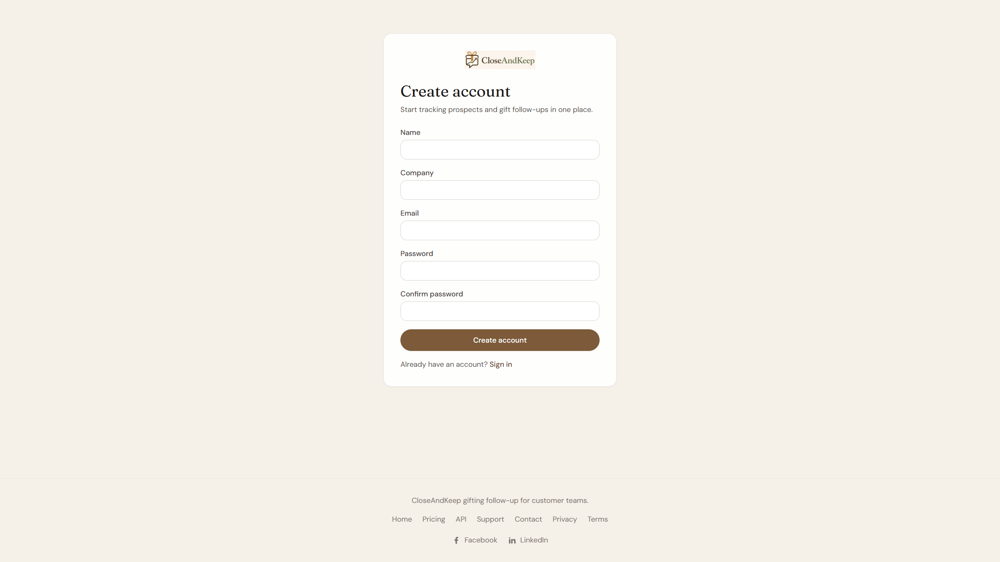

Fill in:

| Field | Rules |
|--------|--------|
| **Name** | Required |
| **Company** | Required |
| **Email** | Use an inbox you can open now |
| **Password** | At least **12 characters**, with at least **one letter** and **one number** |
| **Confirm password** | Must match |

Click **Create account**.

### Step 3. Verify your email

You are sent to **Check your email**.

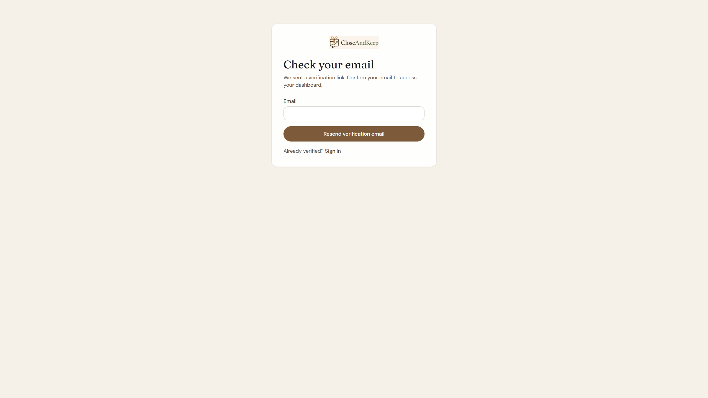

1. Open the message from CloseAndKeep.
2. Click the verification link.
3. If nothing arrives, enter the same email and click **Resend verification email**. Check spam.

Until you verify, you cannot sign in to the dashboard.

### Step 4. Sign in

Go to **[https://www.closeandkeep.com/login](https://www.closeandkeep.com/login)** (or click **Log in** on the homepage).

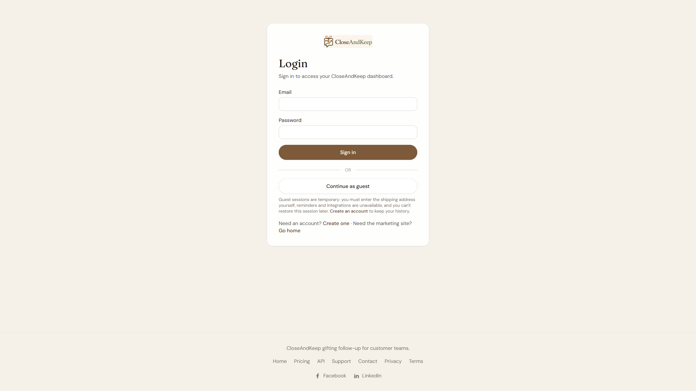

Enter your email and password, then click **Sign in**.

Skip **Continue as guest**. Guests cannot create API keys, and the session cannot be restored later.

### Step 5. You land on the Dashboard

After a full signup, the left nav includes **Dashboard**, **Prospects**, **Orders**, **Follow-ups**, **Integrations**, **Payments**, **API keys**, and **Profile**.

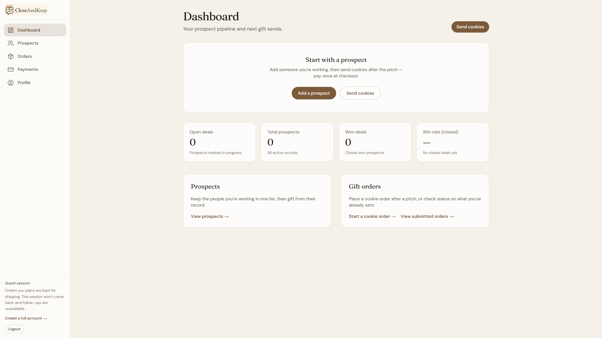

*(The screenshot above is a guest preview of the same layout. On your real account you will not see “Guest session,” and **API keys** / **Integrations** appear in the left nav.)*

Optional but useful: open **Profile**, click **Upload photo**, and add a JPEG/PNG/WebP (up to 2 MB). Recipients can see that photo on gift emails.

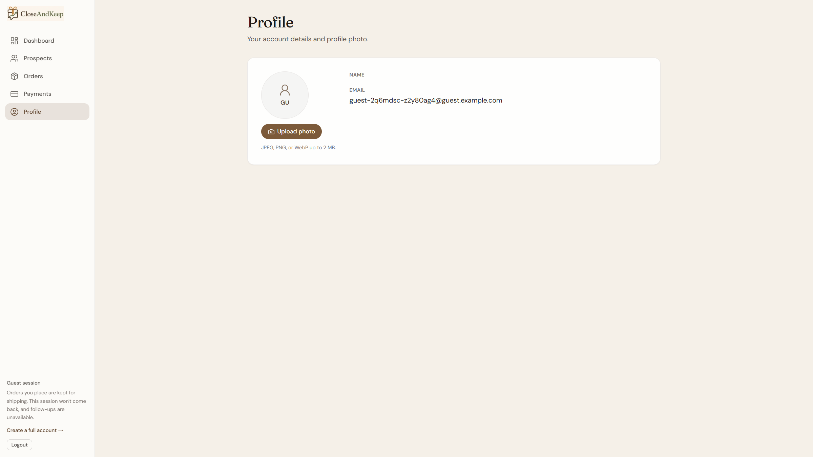

### Step 6. Create an API key (this is the CRM connection)

In the left nav, click **API keys**.

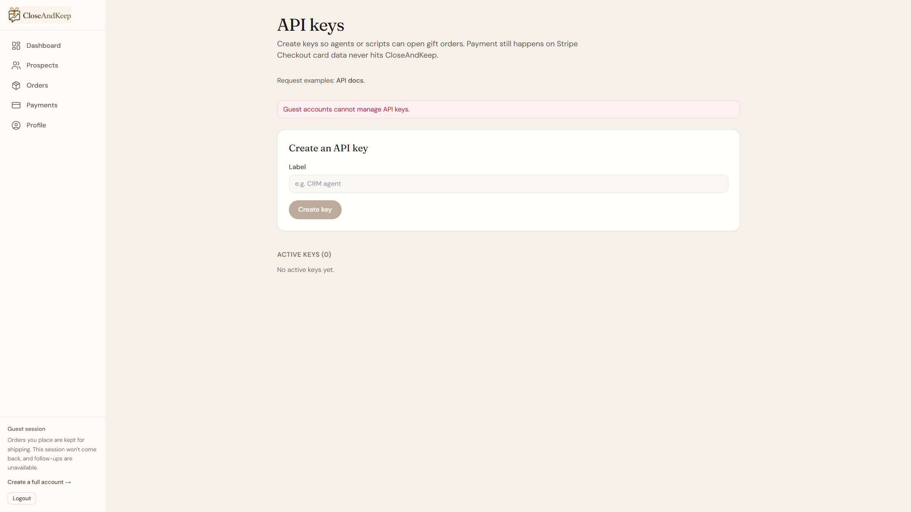

1. Under **Create an API key**, set **Label** to something like `Zack CRM`.
2. Click **Create key**.
3. Copy the full key immediately. It starts with `cak_` and is shown **only once**.
4. Store it like a password (password manager or your CRM’s secret/env settings). Do not put it in a public git repo or a screenshot.

If you lose it, revoke the old key and create a new one.

### Step 7. Skip the Salesforce / HubSpot buttons

**Integrations** is only for Salesforce and HubSpot OAuth. Your custom CRM should **not** click **Connect Salesforce** or **Connect HubSpot**.

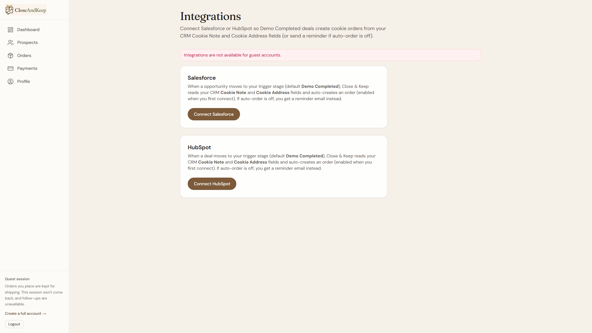

Your connection is the API key from Step 6.

### Step 8. (Optional) Send one test gift by hand

Before wiring the CRM, confirm the account works:

1. **Prospects** → add a name and email → **Add prospect**.

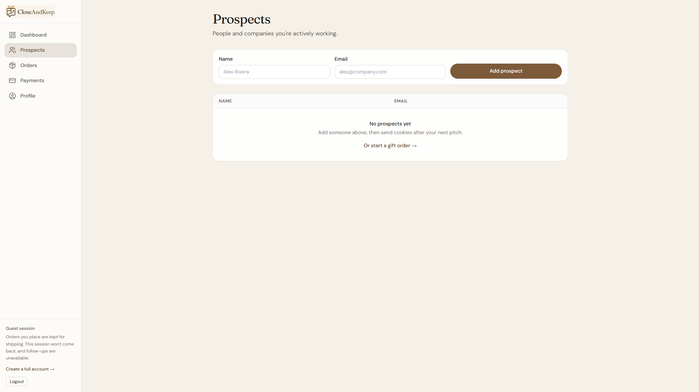

2. **Orders** → **Send cookies** (or **New cookie order**).
3. Choose **4 cookies** or **12 cookies**, add a note, and either enter street / city / state / ZIP or leave them blank so CloseAndKeep emails the recipient for it.
4. Pay on Stripe Checkout.

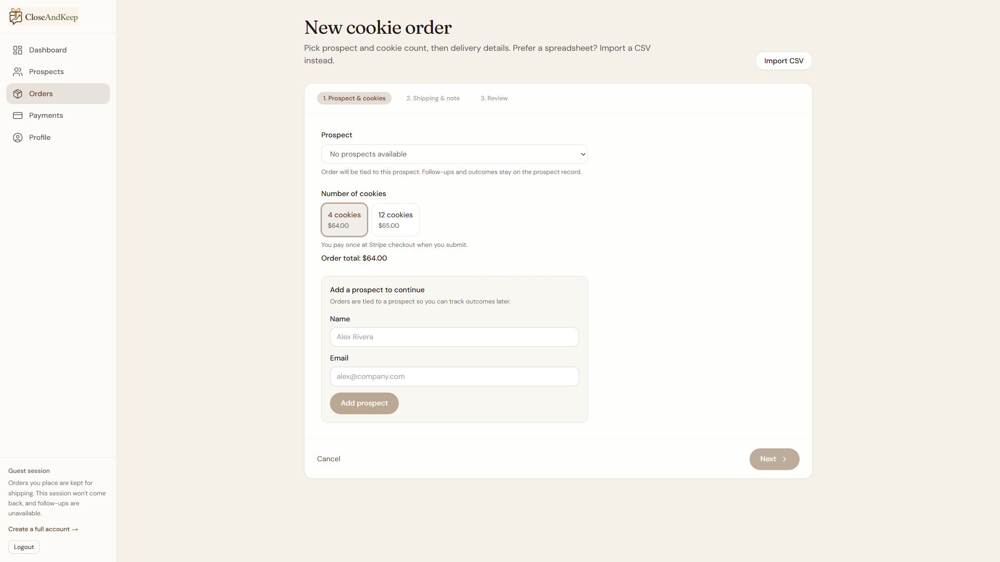

When that works, give Claude the API key and Part 3 below.

---

## Part 2 — What your CRM should look like

Keep reps in your CRM. Do **not** add a CloseAndKeep deal stage — stages are already used for forecasting and other automations. Use a **Send cookies** button instead.

### Fields to add (on the deal / opportunity)

| Field (label in the CRM) | Suggested internal name | Type | Required? | Used for |
|--------------------------|-------------------------|------|-----------|----------|
| Cookie note | `cookie_note` | Long text | Strongly recommended | Personal message on the gift. If blank, use: `Thanks for meeting with us — enjoy these cookies!` |
| Cookie street | `cookie_street` | Text | Optional* | Street address |
| Cookie street 2 | `cookie_street2` | Text | Optional | Apt, suite, unit |
| Cookie city | `cookie_city` | Text | Optional* | City |
| Cookie state | `cookie_state` | Text | Optional* | 2-letter state (e.g. `IL`) |
| Cookie postal code | `cookie_postal_code` | Text | Optional* | ZIP / postal code |
| Cookie pack | `cookie_pack` | Picklist | Optional | `cookies-4` or `cookies-12`. Default **4 cookies**. |
| CloseAndKeep prospect id | `cak_prospect_id` | Number / text | Store after first API call | Avoid creating duplicate prospects |

\*Street, city, state, and postal code are required **together**. If all four are blank, CloseAndKeep emails the recipient a link to enter shipping. Do not concatenate them into one long-text field.

### Button to add

Add a **Send cookies** button (or equivalent action) on the deal, next to the cookie fields. When a rep clicks it, your CRM should call CloseAndKeep. Do not fire this from a stage change.

Also make sure the deal has a **contact name** and **contact email**. Email is required to create a prospect, and it is how we request a shipping address when street/city/state/ZIP are blank.

### What happens when they click Send cookies

1. Your CRM creates (or reuses) a CloseAndKeep **prospect**.
2. Your CRM creates a **gift order** with the note and street/city/state/ZIP (or address-request).
3. CloseAndKeep returns a **Stripe Checkout URL**.
4. Zack (or the rep) opens that URL and pays. Card numbers never go through your CRM or the CloseAndKeep API.

Paid orders move to `queued` for fulfillment.

---

## Part 3 — Paste this into Claude (CRM code changes)

Copy everything in the box below into Claude in the CRM repo.

````markdown
You are updating our custom CRM so that when a rep clicks a "Send cookies" button on a deal, we create a CloseAndKeep cookie gift via their HTTP API. Do NOT trigger this from a deal stage change. Stages are used for other automations.

## Product rules

- Base URL: https://api.closeandkeep.com
- Auth: Authorization: Bearer <API_KEY>  (key starts with cak_)
- Content-Type: application/json
- Do NOT send or store credit card numbers. Payment is Stripe Checkout only.
- Do NOT use Salesforce/HubSpot OAuth. Custom CRMs use API keys only.
- Live docs: https://www.closeandkeep.com/developers
- Gift ids: cookies-4 (default) or cookies-12. Confirm prices with GET https://api.closeandkeep.com/gifts (public, no auth).

## CRM fields to add (if missing)

On Deal/Opportunity:
- cookie_note (long text)
- cookie_street, cookie_city, cookie_state, cookie_postal_code (text; optional together)
- cookie_street2 (text, optional apt/suite)
- cookie_pack (cookies-4 | cookies-12, default cookies-4)
- cak_prospect_id (store the integer id returned by CloseAndKeep)

UI: add a "Send cookies" button on the deal. Do not add a CloseAndKeep deal stage.
Trigger: that button (or "Send cookies again"). Do not fire on stage change.
Need contact name + contact email on the deal.

## API flow

### 1) Create or reuse a prospect

If cak_prospect_id is already set, skip this call and use that id.

POST /prospects
{
  "name": "<contact full name>",
  "email": "<contact email>",
  "deal_status": "open"
}

Response includes integer "id". Save it on the deal as cak_prospect_id.

deal_status allowed values: open | won | lost.

### 2) Create the gift order

POST /gift-orders

If cookie_street, cookie_city, cookie_state, and cookie_postal_code are all filled:

{
  "prospect_id": <cak_prospect_id>,
  "gift_id": "cookies-4",
  "recipient_name": "<contact full name>",
  "shipping_street": "<cookie_street>",
  "shipping_street2": "<cookie_street2 or omit>",
  "shipping_city": "<cookie_city>",
  "shipping_state": "<cookie_state>",
  "shipping_postal_code": "<cookie_postal_code>",
  "note": "<cookie_note or default>"
}

If those address fields are blank (CloseAndKeep emails the recipient for shipping):

{
  "prospect_id": <cak_prospect_id>,
  "gift_id": "cookies-4",
  "recipient_name": "<contact full name>",
  "note": "<cookie_note or default>",
  "request_recipient_address": true,
  "recipient_email": "<contact email>"
}

Default note if cookie_note is blank:
"Thanks for meeting with us — enjoy these cookies!"

note and recipient_name must not be blank/whitespace.
gift_id must be cookies-4 or cookies-12.

### 3) Show checkout to the human

The create-order response includes checkout_url.
- Open it, or show a "Pay for cookies" button/link in the CRM.
- Do not try to charge a card via the API.
- Optionally poll GET /gift-orders/{id} for payment_status and status.
- After payment succeeds, status becomes queued.

If checkout_url is null, surface an error (do not assume monthly billing; that is currently for Salesforce/HubSpot connections).

## Implementation notes

- Store the API key in env/secrets (e.g. CLOSEANDKEEP_API_KEY). Never commit it.
- Fire only when the user clicks "Send cookies". If an order was already created for this deal, do not create another unless they click "Send cookies again".
- Surface API error bodies to the user (400/401/404/429).
- 401 = bad/revoked key. 404 on gift-orders usually means bad prospect_id.
- Endpoints are rate-limited; backoff on 429.
- Optional: after the gift is sent, PATCH /prospects/{id} with deal_status "won" or "lost" when the CRM deal closes.

## Manual test

1. Open a test deal with name, email, cookie_note, and either street/city/state/ZIP or blank address fields. Click Send cookies.
2. Confirm a prospect appears at https://www.closeandkeep.com/prospects
3. Confirm an order appears under Orders.
4. Open checkout_url and complete Stripe Checkout (use a test card only if CloseAndKeep has given you a test mode; otherwise use a real small order they approve).
````

Live request examples (same as [the API page](https://www.closeandkeep.com/developers)):

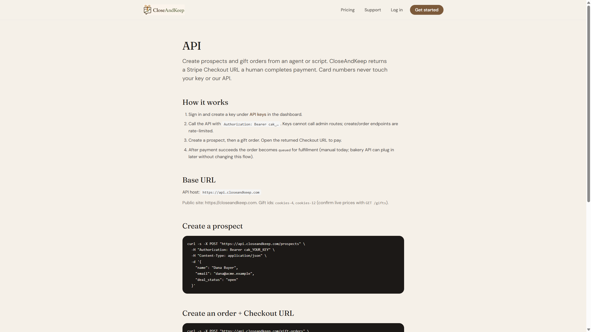

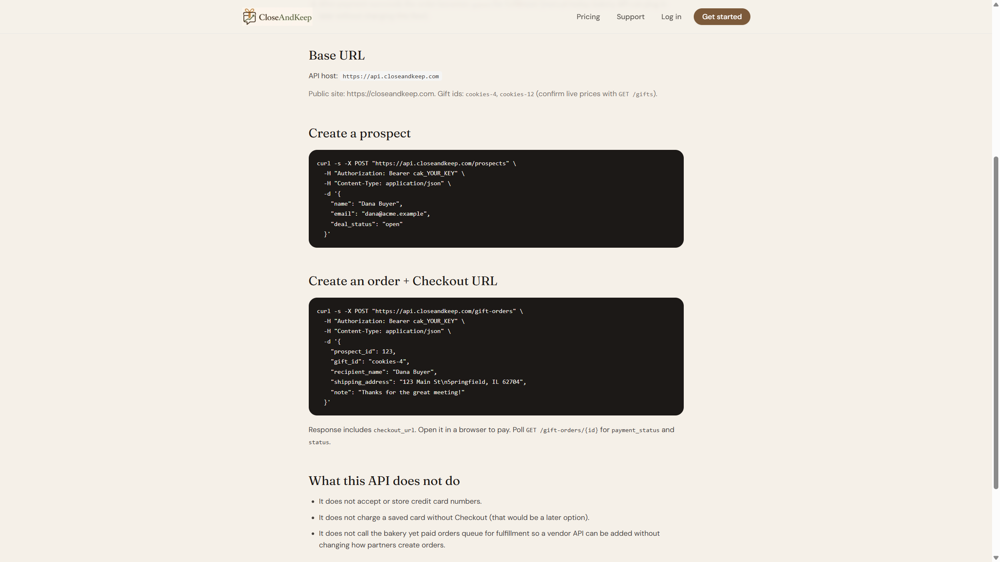

---

## Part 4 — Test the connection

1. In your CRM, open a test deal with a real contact name and email you control.
2. Fill **Cookie note**. Leave street / city / state / ZIP blank the first time (tests the “email them for shipping” path).
3. Click **Send cookies**.
4. Confirm your CRM shows a **Pay for cookies** / Checkout link.
5. In CloseAndKeep, open **Prospects** and **Orders** and confirm the records exist.
6. Complete Stripe Checkout.
7. Confirm the recipient gets the address-request email (if address was blank).

If the CRM call fails, check:

- The key starts with `cak_` and was not revoked.
- You are calling `https://api.closeandkeep.com` (not the website origin).
- `prospect_id` is the integer from `POST /prospects`.
- `gift_id` is exactly `cookies-4` or `cookies-12`.
- `note` is not empty.

---

## Help

- In-app API examples: [https://www.closeandkeep.com/developers](https://www.closeandkeep.com/developers)
- Support: [https://www.closeandkeep.com/support](https://www.closeandkeep.com/support) or closeandkeep@gmail.com
